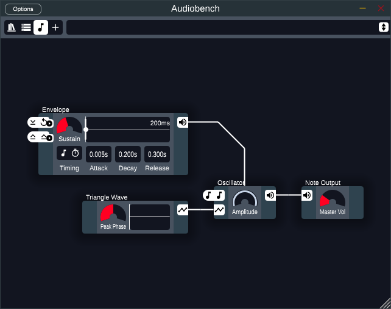
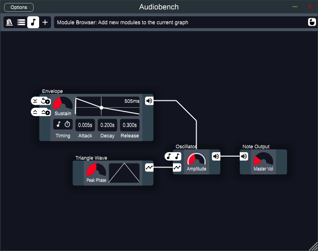
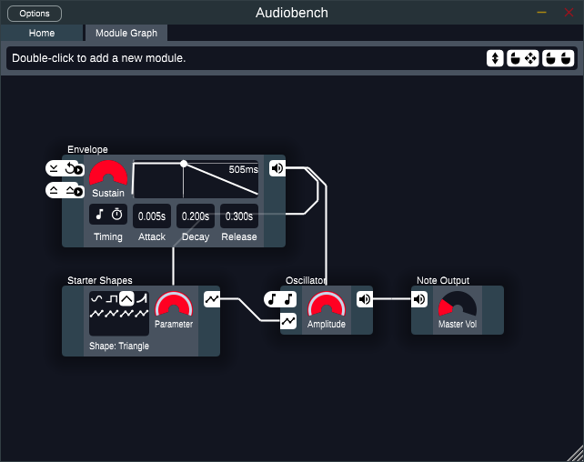
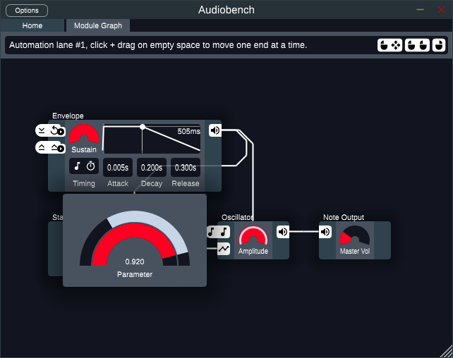
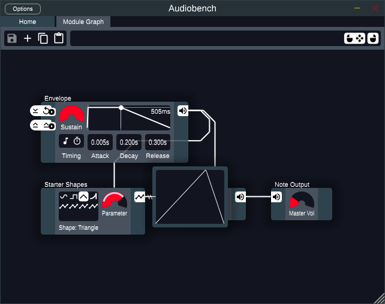
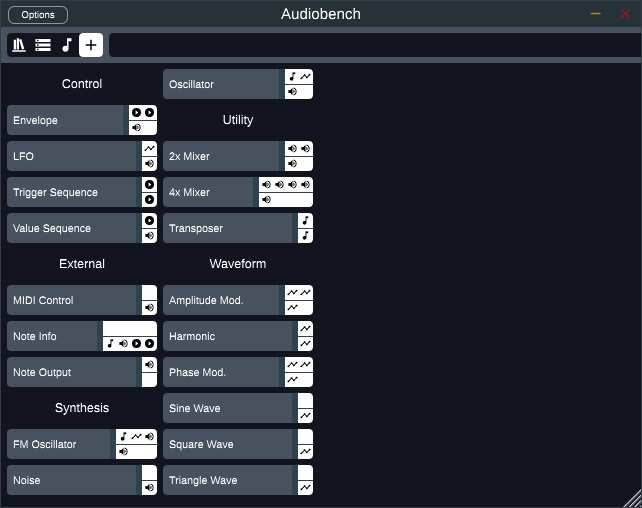

# Getting Started

When you first open Audiobench, you should see something like this:



The main area of the window shown here is called the "note graph", it is where
you can connect modules together to design your sounds. The large bar at the top
will show tooltips describing whatever item you are hovering over as well as the
different ways you can interact with it, such as right click or left click and
drag. The icons at the top left cycle between different interfaces. Hovering
over them will show a tooltip describing their function. If anything appears too
small, you can resize the window to make it bigger.

This simple default patch already contains all the concepts you need to know to
get started making sounds with Audiobench. The patch is made of four 
**modules**, each showing their name above them. Each module has **controls**
that change their behavior. The modules are connected together through 
**wires**. All told, this patch makes a simple "ding" sound. Playing a note
will reveal how the modules affect each other:



The *amplitude* (also known as volume) of the oscillator module is being
affected by the wire coming from the envelope module. We say that the
*amplitude* control is **automated** by the output from the envelope. If you
change some of the controls on the envelope by clicking and dragging them, you
change how the *amplitude* of the oscillator changes over time. The only
controls that can be automated at the moment are **knobs** and **sliders**. You
can automate them by dragging a wire from an output onto one of these controls.
One way to make this patch more interesting is by making the envelope automate
the *parameter* control on the basic shape module:



You can change the range of the automation by right-clicking on the knob and
clicking and dragging on the **automation lane**. You can also right-click on
the lane itself to remove its automation from the control. 



While hovering over the basic shape module a box will appear to show you the
shape the module is outputting. Hovering over some other modules will show you
the audio they are outputting.



You may have noticed while setting that up that the audio cut out and a
notification saying "working" appeared. Because of how Audiobench works
internally, some changes necessitate doing a slow, one-time process called
"compilation" before you can start playing notes again. This process will not
occur whenever you modify a control. 


The last thing to talk about is **inputs** and **outputs**. These are the white
boxes that appear on the sides of each module. Inputs are on the left and
outputs are on the right. Each of them has a specific type, so that pitch inputs
can only be connected to pitch outputs, waveform inputs can only be connected to
waveform outputs, and so on. Audio outputs are special because they also allows
you to automate knobs and sliders in addition to connecting to audio inputs.
When an input is not connected, it uses a default value instead. If you hover
over the envelope module, you will notice it says that the input to reset the
envelope uses the default value of whenever the note starts, and the input to
release it uses whenever the note releases. Similarly, the pitch of the
oscillator defaults to the pitch of the note you are currently playing. Clicking
on an unconnected input will cycle between different default values. For
example, disconnecting the triangle wave from the oscillator would let you cycle
through a handful of default waveforms. Inputs and outputs can be connected by
clicking and dragging.

# Beyond The Default Patch
To really start making some noise, you'll want to add in more modules.
Double-clicking the module graph takes you to the **module browser**, which
lists all available modules:



Clicking on one will add it to the note graph. You can click and drag the module
to move it around, or click and drag on the background to pan your view.
Scrolling on the background will zoom in and out to help with building larger
patches.


Once you have something you like, you can save your patch by clicking the '+'
button to save it in a new file. (You may need to hover over the top bar to
reveal the button.) You can then change the name in the home tab. You can save
additional changes to the same patch by clicking the save button, or to a new
patch by clicking the '+' button again. If you want to easily share your patch
with other people, click the copy button to get a piece of text that represents
your patch. Others can then copy that text and click the paste button to load
your patch. You can try it out with this code for the patch in the picture
above:

```
AgcARGVmYXVsdAEHAEZhY3RvcnkgAgUAAsj-__9w____AABgAAAAGAAAAAAB0P___xgAAAAAA_j-__8wAAAAAATw_f__6P___0D4_weAwvXoDs3MTD5oZmb6FAAAAAgcABMAAAD8_xNIAAAA_v-N_38AgAAAAAD8IQA
```

# Miscellaneous Tips
- Right-clicking a duration control lets you adjust it as a fraction instead of
  a number.
- The timing control lets you set if durations should be in terms of beats or
  seconds and also lets you sync up certain modules with the current time in
  your song.
- The library browser will tell you what new features are available if a new
  version of Audiobench has been released.
